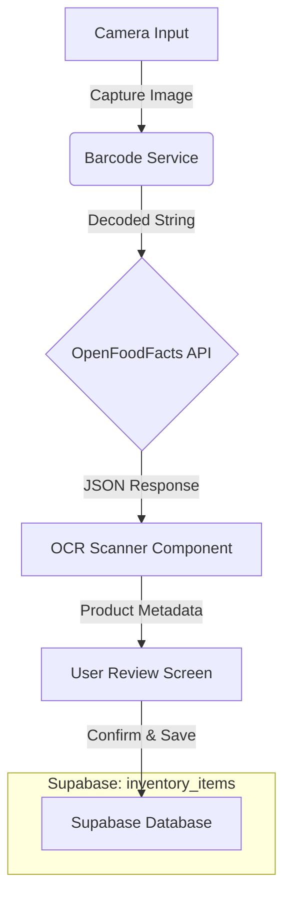

# OpenFoodFacts & Barcode Integration Report

This report documents how the NoshNurture application integrates with OpenFoodFacts to provide product details from barcode scanning, and how that data is subsequently stored in the application's database.

## 1. Overview Pattern

The integration follows a "Scan → Enrich → Review → Store" pattern:
1.  **Scan**: The camera captures an image.
2.  **Decode**: A local library decodes the barcode from the image.
3.  **Enrich**: The barcode is sent to OpenFoodFacts API to retrieve product metadata (name, nutrition, image).
4.  **Review**: The user verifies the info (and captures an expiry date if needed).
5.  **Store**: The final verified data is saved to Supabase.

## 2. Technical Implementation Steps

### Step 1: Barcode Detection
**File:** `src/lib/barcode-service.ts`
- **Library**: `html5-qrcode`
- **Function**: `detectBarcodeInImage(imageFile)`
- **Logic**: Creates a temporary hidden HTML element to process the image file and attempts to find any standard barcode (EAN-13, UPC, etc.). It returns the raw barcode string (e.g., "8901234567890").

### Step 2: OpenFoodFacts API Call
**File:** `src/lib/openfoodfacts-service.ts`
- **Function**: `getNutritionIntelligence(query, 'barcode')`
- **API Endpoint**: `https://world.openfoodfacts.org/api/v2/product/{barcode}.json`
- **Data Extracted**:
    -   `product_name`: Name of the product (e.g., "Amul Butter").
    -   `brands`: Brand name.
    -   `image_front_url`: URL of the product image.
    -   `ingredients_text`: List of ingredients (used for analyzing if it's vegan, etc.).
    -   `nutriments`: Macro-nutrients (sugar, fat, protein) for health analysis.
    -   `quantity`: Pack size (e.g., "500g").

### Step 3: UI & Intelligence Integration
**File:** `src/components/OCRScanner.tsx`
- **Component**: `<OCRScanner />`
- **Logic**:
    1.  Captures photo → calls `detectBarcodeInImage`.
    2.  If barcode found → calls `getProductByBarcode` (wrapper for OFF service).
    3.  **Auto-Fill**: Pre-fills the "Scanned Product" state with the name and image from OpenFoodFacts.
    4.  **Expiry Date**: Prompts the user to take a second photo specifically for the expiry date (since barcodes don't contain expiry dates).

### Step 4: Data Handover
**File:** `src/app/scanner/page.tsx`
- **Callback**: `handleOCRDetection(data)`
- **Logic**: When the user confirms the scan in `OCRScanner`, this function is triggered. It combines:
    -   Product Name (from OpenFoodFacts)
    -   Expiry Date (from OCR/Manual input)
    -   Quantity (from OpenFoodFacts or manual)
- **State**: The data is standardized into an `InventoryItem` object and stored in the `scannedData` state variable, awaiting user confirmation to save.

### Step 5: Database Storage (Supabase)
**File:** `src/app/scanner/page.tsx`
- **Function**: `handleSaveToInventory()`
- **Logic**: Triggered when the user clicks "Save" on the review screen.
- **Destination**: `inventory_items` table in Supabase.
- **Mapped Fields**:
    -   `product_name`: Saved from OpenFoodFacts data.
    -   `tags`: Can include batch numbers or `measured` tags.
    -   `quantity` / `unit`: Parsed from the API response (e.g., "500" "g").
    -   `expiry_date`: stored as `YYYY-MM-DD`.

## 3. Data Flow Diagram

## 4. Key Files
- `src/lib/openfoodfacts-service.ts`: API Client.
- `src/lib/barcode-service.ts`: Decoder.
- `src/components/OCRScanner.tsx`: UI Logic.
- `src/app/scanner/page.tsx`: Controller & Database interaction.
